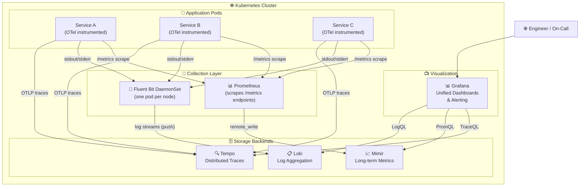
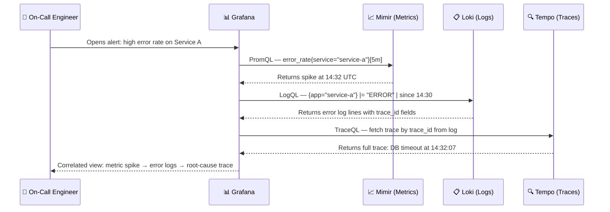

# devops-observability-loki-grafana-mimir-tempo

> Full-stack observability on Kubernetes using Grafana's LGTM stack — Loki (logs), Grafana (visualization), Tempo (traces), and Mimir (metrics) — with Fluent Bit as the unified log/metric collector.

---

## Problem Statement

Modern distributed systems running on Kubernetes generate three distinct signals — **logs, metrics, and traces** — that most teams store and query in silos. Without a unified observability stack, correlating a spike in error logs with the responsible service trace and the corresponding infrastructure metrics requires context-switching across 3–4 separate tools, dramatically slowing incident response time.

Grafana's LGTM stack (Loki + Grafana + Tempo + Mimir) solves this by giving every signal a dedicated, cost-efficient backend that Grafana can correlate in a single dashboard — linking a log line directly to the trace that generated it, and the metric that was degraded at that moment.

---

## Solution Overview

This repository deploys the complete LGTM observability stack on Kubernetes using Helm. Fluent Bit runs as a DaemonSet to collect logs from every pod and node and ships them to Loki. Prometheus-compatible metrics are remote-written to Mimir for long-term scalable storage. Applications instrument with OpenTelemetry and send traces to Tempo. Grafana is configured with all four datasources and pre-loaded dashboards out of the box.

---

## Architecture



---

## Signal Correlation Flow



---

## Tech Stack

| Layer | Technology | Version |
|---|---|---|
| Log Aggregation | Grafana Loki | 6.x (Helm chart) |
| Metrics Storage | Grafana Mimir | 5.x (Helm chart) |
| Distributed Tracing | Grafana Tempo | 1.x (Helm chart) |
| Visualization & Alerting | Grafana | 11.x (Helm chart) |
| Log / Metric Collection | Fluent Bit | 0.47.x (Helm chart) |
| Orchestration | Kubernetes | 1.28+ |
| Package Manager | Helm | 3.x |

---

## Prerequisites

- [ ] `kubectl` installed and configured against your cluster (`kubectl get nodes`)
- [ ] `helm` >= 3.10 installed (`helm version`)
- [ ] Kubernetes cluster with at least **4 vCPU / 8 GB RAM** available for the stack
- [ ] `kubectl` context set to the correct cluster (`kubectl config current-context`)
- [ ] Persistent volume support in the cluster (StorageClass available)
- [ ] Grafana Helm repo added (handled by `prerequisites.sh`)

---

## Quick Start

```bash
# 1. Clone the repository
git clone https://github.com/NaumanMunir9/devops-observability-loki-grafana-mimir-tempo
cd devops-observability-loki-grafana-mimir-tempo

# 2. Run prerequisites check and add Helm repos
bash scripts/prerequisites.sh

# 3. Deploy the full observability stack
bash scripts/deploy.sh

# 4. Get the Grafana admin password
kubectl get secret --namespace observability grafana \
  -o jsonpath="{.data.admin-password}" | base64 --decode; echo

# 5. Port-forward Grafana to localhost
kubectl port-forward --namespace observability svc/grafana 3000:80
# Open http://localhost:3000 — login: admin / <password from step 4>
```

---

## Detailed Deployment Steps

### Step 1 — Create Namespace and Core Config

```bash
kubectl apply -f kubernetes/namespace.yaml
kubectl apply -f kubernetes/configmap.yaml
```

### Step 2 — Deploy Mimir (Metrics Backend)

```bash
helm upgrade --install mimir grafana/mimir-distributed \
  --namespace observability \
  --values helm/mimir/values.yaml \
  --wait --timeout 5m
```

### Step 3 — Deploy Loki (Log Backend)

```bash
helm upgrade --install loki grafana/loki \
  --namespace observability \
  --values helm/loki/values.yaml \
  --wait --timeout 5m
```

### Step 4 — Deploy Tempo (Trace Backend)

```bash
helm upgrade --install tempo grafana/tempo-distributed \
  --namespace observability \
  --values helm/tempo/values.yaml \
  --wait --timeout 5m
```

### Step 5 — Deploy Fluent Bit (Log/Metric Collector)

```bash
helm upgrade --install fluent-bit fluent/fluent-bit \
  --namespace observability \
  --values helm/fluent-bit/values.yaml \
  --wait --timeout 3m
```

### Step 6 — Deploy Grafana (Visualization)

```bash
helm upgrade --install grafana grafana/grafana \
  --namespace observability \
  --values helm/grafana/values.yaml \
  --wait --timeout 3m
```

### Step 7 — Verify All Pods Are Running

```bash
kubectl get pods -n observability
# All pods should show STATUS: Running
```

---

## Configuration Reference

| Variable | File | Description | Default |
|---|---|---|---|
| `loki.auth_enabled` | `helm/loki/values.yaml` | Multi-tenant auth | `false` |
| `mimir.minio.enabled` | `helm/mimir/values.yaml` | Use bundled MinIO for object storage | `true` |
| `tempo.traces.otlp.http.enabled` | `helm/tempo/values.yaml` | Accept OTLP traces over HTTP | `true` |
| `grafana.adminPassword` | `helm/grafana/values.yaml` | Grafana admin password | `changeme` |
| `fluent-bit.config.outputs` | `helm/fluent-bit/values.yaml` | Loki endpoint for log shipping | `http://loki:3100` |

---

## Architecture Decisions

- **Why Mimir over Thanos:** Mimir is operationally simpler for single-cluster deployments and natively compatible with Grafana's alerting stack (including Alertmanager via Mimir's ruler component).
- **Why Loki over Elasticsearch:** Loki indexes only metadata (labels), not full-text. This yields 10–50x lower storage cost for the same log volume at the cost of slower ad-hoc text searches — the right tradeoff for structured Kubernetes log shipping.
- **Why Fluent Bit over Fluentd:** Fluent Bit is written in C, uses ~1/10th the memory of Fluentd, and is purpose-built for Kubernetes DaemonSet deployments.
- **Why Tempo for traces:** Tempo integrates natively with Grafana's exemplar and trace correlation features, enabling direct log→trace→metric navigation in a single UI.

---

## Cost Estimate (Self-Hosted on Kubernetes)

| Resource | Description | Monthly Cost |
|---|---|---|
| Persistent Volumes | Loki + Mimir + Tempo storage (200GB total) | ~$20–40 |
| Extra Node Capacity | ~2 vCPU / 4GB RAM for the stack | ~$30–60 |
| Object Storage | MinIO or S3 for Mimir/Loki long-term storage | ~$5–15 |
| **Total** | | **~$55–115/month** |

*Cost varies significantly by cloud provider and cluster size.*

---

## Cleanup

```bash
# Remove all Helm releases
bash scripts/teardown.sh

# Remove namespace (deletes all PVCs — data will be lost)
kubectl delete namespace observability
```

---

## Author

**Nauman Munir** — Senior DevOps & Cloud Engineer
- 🔗 [LinkedIn](https://linkedin.com/in/naumanmunir9)
- 💼 [Upwork](https://upwork.com/freelancers/naumanmunir9)
- 🐙 [GitHub](https://github.com/NaumanMunir9)

---
*Available for DevOps and Cloud Engineering engagements. Open to discussing your observability challenges.*
