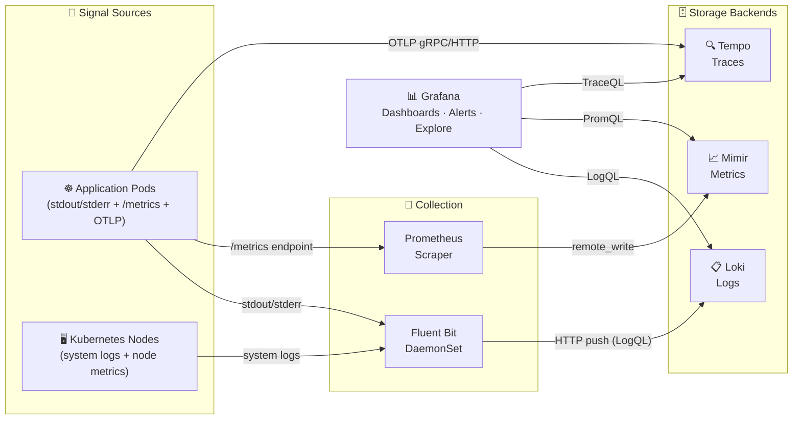
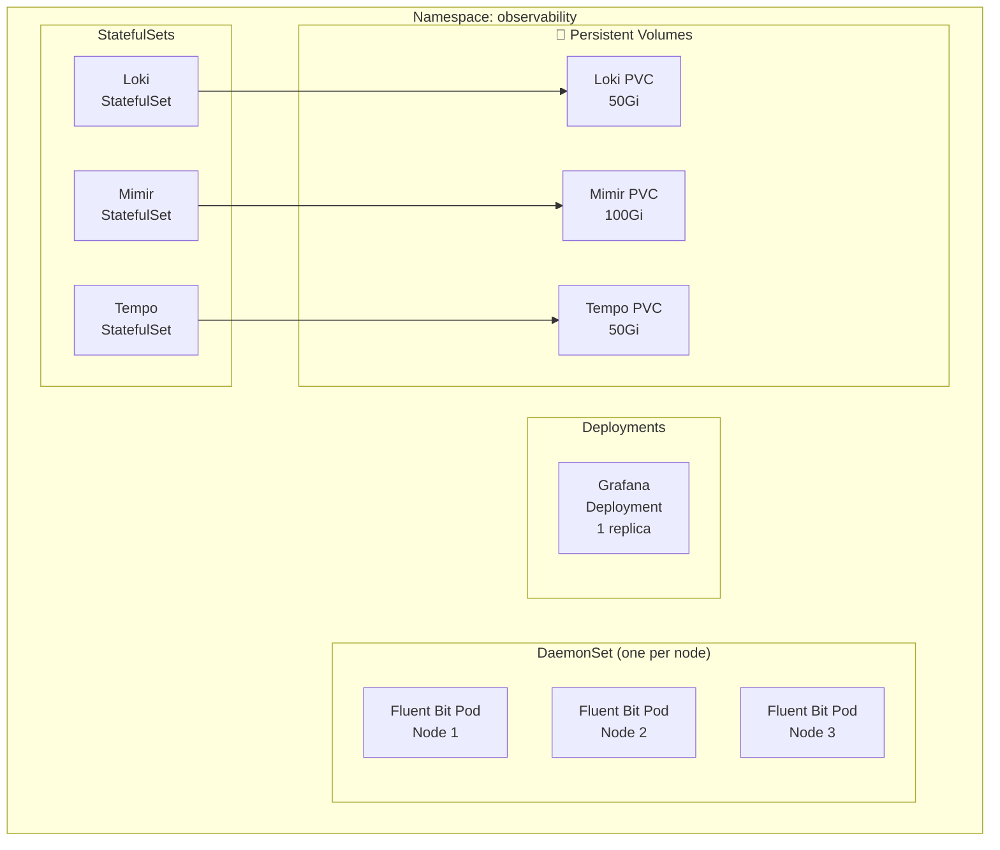
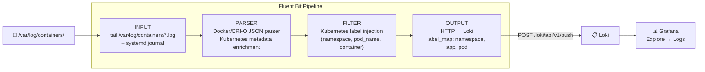
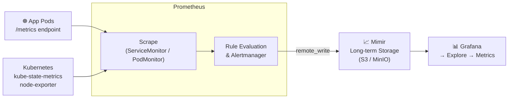
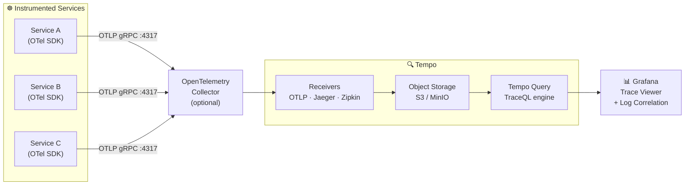
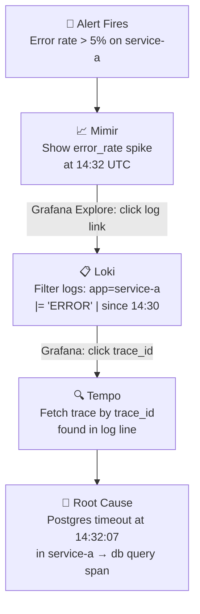
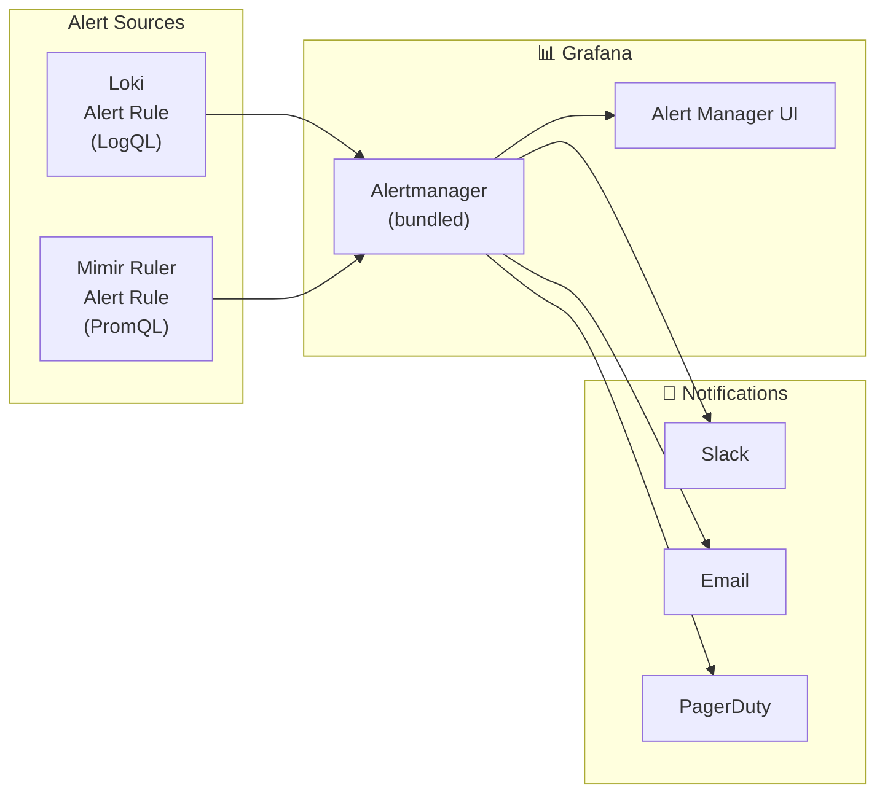

# Architecture — Observability Stack (LGTM + Fluent Bit)

> All diagrams render natively on GitHub. Built with Mermaid JS.

---

## 1. High-Level System Overview

---

## 2. Kubernetes Deployment Layout

---

## 3. Log Pipeline — Fluent Bit to Loki

---

## 4. Metrics Pipeline — Prometheus to Mimir

---

## 5. Trace Pipeline — OpenTelemetry to Tempo

---

## 6. Signal Correlation in Grafana

---

## 7. Alerting Flow

